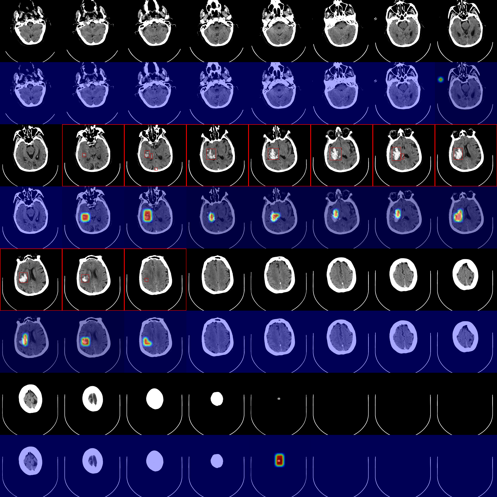
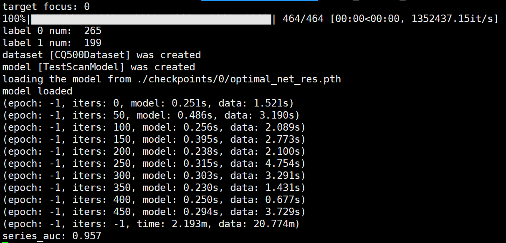
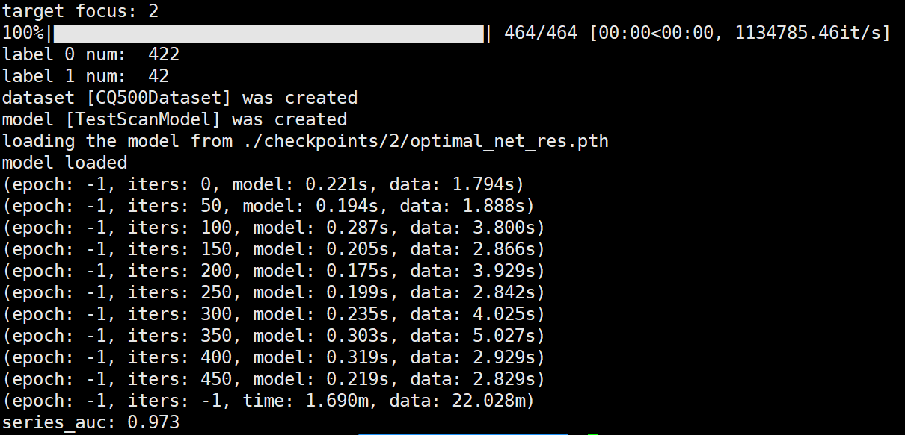

# Deep learning with weak annotation from diagnosis reports for detection of multiple head disorders: a prospective, multicentre study

### Introduction

This project contains source code and data for our manuscript "Deep learning with weak annotation from diagnosis reports for detection of multiple head disorders: a prospective, multicentre study".

### Requirements

+ Python >= 3.6
+ CUDA >= 10.0
+ pip >= 20.0

We recommend that you create a new python environment by `anaconda` or `virtualenv` . Other requirements can be found in `requirements.txt` and installed by:

```shell
pip install -r requirements.txt
```

### Get Started

#### Visualize on Example CT Scans

To visualize results on all four types of head disorders, run `demo.sh` :

```shell
source demo.sh
```

The output images are saved in `./vis` , and detailed output predictions are saved in `./stat_info` . Here is an example from a CT scan (./data/0/0_0) with hemorrhage lesion:



The argument `target_focus` specifies the target head disorder:

| target focus | head disorder  |
| ------------ | -------------- |
| 0            | hemorrhage     |
| 1            | brain ischemia |
| 2            | skull fracture |
| 3            | tumor          |


You can choose available GPU device by setting  `CUDA_VISIBLE_DEVICES` in command line.

#### Test on CQ500 Dataset

First, download dataset from http://headctstudy.qure.ai/dataset to somewhere (`$PATH`), then extract data by:

```shell
source make_cq500.sh $PATH
```

after this step, there should be extracted data in `./data/cq500` . Finally run `test.sh` :

```shell
source test.sh
```

the AUC score should be printed on screen. The output of hemorrhage experiment looks like:



and the output of fracture experiment looks like:



Detailed predictions are saved in `./cq500_stat_info` .

You can choose available GPU device by setting  `CUDA_VISIBLE_DEVICES` in command line.

### CAD software
the computer-aided detection software can be installed directly with [cad.exe](cad.exe)

### License

This project is only available to reviewers now.

